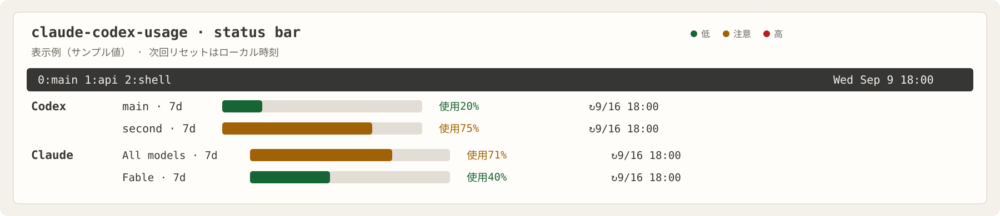

# claude-codex-usage — Claude Code / Codex Usage Monitor

tmuxで動かしているClaude Code・Codex・Geminiの状態と、複数アカウントの利用枠を確認できるCLIです。承認待ちの確認、ペインへの移動、ステータスバーへの使用量ゲージ表示に対応しています。

This is a small, standard-library-only Go CLI for monitoring Claude Code, Codex, and Gemini panes in tmux and displaying multi-account usage limits. It runs locally; the provider CLIs (`codex` and `claude`, when usage collection is enabled) remain required.



上の画像は各枠を見やすく展開した説明図（サンプル値）です。実際のtmuxではCodexとClaudeをそれぞれ1行にまとめます。ゲージの塗りつぶしが使用済み、背景部分が残りです。`7d`は7日枠を表し、取得できる場合は次回リセット日時（例：`↻9/16 18:00`）も表示します。色だけに頼らず、`使用`（使用済み）を文字でも表示します。

## 起動

[Releases](https://github.com/n-hiraha/claude-codex-usage/releases/latest)からOS・CPUに合ったファイルをダウンロードして展開すると、実行ファイル1つで使えます。**実行時にGoやNode.jsは不要です。** tmuxと、使用量を取得するCodex・Claude CLIは別途必要です。

| 環境 | ファイル名の末尾 |
| --- | --- |
| Mac（Apple Silicon） | `darwin-arm64.tar.gz` |
| Mac（Intel） | `darwin-amd64.tar.gz` |
| Linux（x86_64） | `linux-amd64.tar.gz` |
| Linux（ARM64） | `linux-arm64.tar.gz` |

展開したフォルダで`./claude-codex-usage usage --demo`を実行すると、ログインなしで表示を試せます。配布ファイルの検証用に`SHA256SUMS`も付属します。macOSの配布バイナリは署名・公証していないため、初回起動時にOSの確認が必要になる場合があります。

以下はソースからビルドする場合の手順です（Go 1.24以上・makeが必要）。

```sh
git clone https://github.com/n-hiraha/claude-codex-usage.git
cd claude-codex-usage

make build
MONITOR=./dist/claude-codex-usage

# 画面を試す（tmuxセッション不要）
$MONITOR watch --demo

# 実際のセッションを表示
$MONITOR status
$MONITOR watch
$MONITOR attention
$MONITOR status --json
$MONITOR watch --agent codex --bell
$MONITOR watch --attention

# tmux内で実行。表示されたペインIDを指定
$MONITOR jump %3
```

`watch`は2秒ごとに更新し、画面に表示されている番号の`1`〜`9`で移動、`q`またはCtrl-Cで終了します。デモ表示では移動しません。パイプやTTYのない環境では一度だけ表示します。`--interval 5`で更新間隔を変更できます。独立したtmuxサーバーには`--socket NAME`（`tmux -L NAME`）を指定します。

`a`で全状態と承認待ち・入力待ちの表示を切り替えます。`--agent claude|codex|gemini`で対象AIを絞れます。番号キーはそのとき画面に表示されている一覧に対応します。

`--bell`は、ライブ表示中に新たな承認待ち、または応答中・ツール実行から入力待ちへの変化を検出したとき、ターミナルベルを鳴らします。起動時の一覧や同じ状態のままの更新では鳴らしません。実際に音が鳴るかはターミナルの設定によります。状態の経過時間は監視開始後の観測時間です。履歴は保存しません。

## アカウント別usage（Codex・Claude）

```sh
# Codex 2アカウント＋Claudeのサンプル表示（ネットワーク接続なし）
$MONITOR usage --demo

# 現在のCODEX_HOME（未指定なら ~/.codex）
$MONITOR usage

# ログイン用フォルダを分けている場合
cp accounts.example.json accounts.local.json
# accounts.local.json の絶対パスとメールアドレスを自分のものに編集
$MONITOR usage --accounts accounts.local.json
$MONITOR usage --accounts accounts.local.json --json
```

Codexは各`CODEX_HOME`でログインしておきます。公式のファイル保存方式を使う場合は、たとえば次のように実行します。

```sh
CODEX_HOME=/absolute/path/to/codex-main codex -c cli_auth_credentials_store='file' login
CODEX_HOME=/absolute/path/to/codex-second codex -c cli_auth_credentials_store='file' login
```

設定ファイルは[`accounts.example.json`](accounts.example.json)をコピーして作成します。実際のパスとメールアドレスを`accounts.local.json`（Git対象外）に記入してください。

`usage`は[Codex app-serverの公式プロトコル](https://learn.chatgpt.com/docs/app-server)を使い、プロファイルごとの利用枠・使用率・残り率・リセット時刻を取得します。提供される場合は累計トークンと直近最大7日分の日別トークンも表示します。期間はサービスの返す値を使うため、5時間・週以外の枠にも対応します。API料金は計算しません。

- 各`codexHome`は、そのアカウントでログイン済みのCodex用ディレクトリを指定してください。`~`の展開は行わないので絶対パスを使います。
- `expectedEmail`は任意です。指定したメールとログイン中のアカウントが異なれば、取り違えを避けるためusageを表示しません。
- 同じホームの重複は拒否します。同じメールが複数のホームから返された場合も警告し、値を合算しません。
- Codexの取得ではモニター自身は認証ファイルを読み取りません。指定ホームで`codex app-server`を起動し、アカウント情報とusageの読み取りだけを要求します。会話・ターン作成やログイン切り替えは行いません。Codex側は通常の起動処理や認証更新に伴いホーム内のファイルを更新する場合があります。
- このコマンドはCodex経由でサービスに接続します。tmux監視コマンドはローカルだけで動作します。
- 古いCLIやAPIキーのみの認証など、取得できない項目は不明・取得不可として扱います。0%とは表示しません。
- アカウントとペインの対応づけは未実装です。Geminiのアカウント別利用枠、ログイン切り替え履歴、別Macのusageの集約も未対応です。
- `accounts.local.json`はGit対象外です。公開用の設定例には架空のパスとメールだけを載せています。
- `usage`コマンドはClaudeの利用枠を`claudeHome`ごとに5時間枠・7日枠で表示し、tmuxバーには週次枠だけを表示します。Claude側が提供する場合は、レスポンスの`limits`にある`scope.model.display_name`が`Fable`の、サーバーが返した週次（7日）枠も`Fable`専用として表示します。Fableを提供していないClaudeアカウントでは、その枠を0%として補いません。

## tmuxバーへの組み込み

```sh
# 設定ファイルをこのフォルダに生成して内容を確認
./dist/claude-codex-usage setup tmux --split-providers --accounts "$PWD/accounts.local.json" > tmux-ai-monitor.conf
cat tmux-ai-monitor.conf

# tmux内で設定を読み込む
tmux source-file "$PWD/tmux-ai-monitor.conf"
```

3行構成では、1行目にtmuxのウィンドウ名や時計、2行目にCodex、3行目にClaudeの利用枠を表示します。Codexの行にはアカウント別ゲージ、Claudeの行には`All models`（全モデル共通）と`Fable`（Fable専用）を表示します。ClaudeのバーはWebの週次枠に対応する`All models`と`Fable`のみを表示し、現在のセッション（5時間枠）は省略します。塗られた部分が使用済み、背景部分が残りです。取得できる場合は次回リセットの日時も表示します。元のCPU・時計などの右側バーは維持します。`prefix + a`でAIセッションのライブ一覧をポップアップ表示します。生成した設定は`status`、`status-position`、`status-format[1]`、`status-format[2]`、`status-interval`、`prefix + a`を設定します。既存の2・3行目がある場合は読み込む前に統合してください。設定生成コマンド自身はホームの設定を変更しません。

設定生成時にCodex・Claude CLIの実行ファイルのパスを解決して埋め込むため、tmuxの古いPATHでも利用できます。必要なら`--codex-bin /absolute/path/to/codex`・`--claude-bin /absolute/path/to/claude`で指定できます。

生成した設定を読み込んだ後はtmuxの再起動は不要です。`tmux source-file /absolute/path/to/tmux-ai-monitor.conf`を実行すると現在のサーバーに反映されます。AIセッション一覧は`prefix + a`で開きます。

ゲージはCodexのみなら60秒、Claudeを含む設定では5分に一度取得し、表示にはキャッシュを利用します。キャッシュにはアカウントの表示名と利用枠だけを保存し、メールアドレスやトークン履歴は保存しません。保存先は`$XDG_CACHE_HOME/claude-codex-usage`、未指定なら`~/.cache/claude-codex-usage`です。再取得中の古い値には更新待ちを示す表示が付きます。取得できない値や不明な値を0%として表示することはありません。

複数アカウントをバーに載せる場合は、`setup tmux --split-providers --accounts /absolute/path/to/accounts.local.json`で生成した設定を使ってください。画面幅に収まらない分は省略数を表示します。

常用する場合は、生成したファイルの絶対パスを使い、`~/.tmux.conf`に`source-file /absolute/path/tmux-ai-monitor.conf`を追加できます。解除時はその行を削除し、従来のバー設定・キー設定を再適用してください。ポップアップにはtmux 3.2以上が必要です。

## 状態と制約

| 表示 | 意味 |
| --- | --- |
| ! 承認待ち | 画面に承認プロンプトを検出 |
| ~ 応答中 | 生成中の表示を検出 |
| > ツール実行 | ツール実行の表示を検出 |
| + 入力待ち | 完了・入力プロンプトを検出 |
| ? 不明 | 状態の根拠になる表示が見つからない |

- 対象は指定tmuxサーバー内のペインに紐づくAIプロセスです。tmux外のアプリやセッションは表示しません。
- 状態は直近のペイン画面からの推定であり、確定情報ではありません。CLIの表示変更、スクロール位置、過去の出力によって誤判定や不明になることがあります。
- CPUとメモリは検出したAIプロセスの値です。子ツール全体の合算ではありません。
- 移動には表示順で変わらない`%ID`を使用します。セッションが終了した場合はtmuxのエラーになります。
- tmux監視はネットワーク送信、会話ログの保存、APIキーの読み取りを行いません。ペインの出力は判定時にメモリ内でのみ使用します。`usage`の接続については上記を参照してください。
- セッションごとのトークン集計、セッション履歴、デスクトップ通知、常駐デーモンは未実装です。
- macOSとLinux向けのコマンド構成です。Linux実機の動作確認は未実施です。

## 開発

```sh
go test ./...
go vet ./...

# 専用の一時tmuxサーバーを起動し、検証後に削除
RUN_TMUX_TESTS=1 go test ./...
```

`cmd/claude-codex-usage`がCLIを提供し、`internal/`以下がtmux監視、表示、設定生成、利用枠取得を担当します。依存ライブラリはGo標準ライブラリだけです。

Go版は認証・JSONLプロトコル・キャッシュ・表示・セッション判定の自動テストとrace検出を実施しています。macOS実機ではCodexの2アカウントとClaudeの1アカウントの利用枠取得、8セッションの検出、tmux設定の読み込みとポップアップのキー操作を確認しました。Linux向けはクロスビルド済みで、Linux実機の表示確認は未実施です。

## Claudeの利用枠

設定に`provider: "claude"`と`claudeHome`（Claude Codeの設定ディレクトリの絶対パス）を追加すると、Claude.aiの利用枠を取得します。tmuxバーには週次枠のみ、`usage`コマンドには5時間枠と週次枠を表示します。`expectedEmail`でアカウントの取り違えを検出できます。Claude Codeにサブスクリプションアカウントでログインしている必要があります。APIキーの使用量・請求額は対象外です。

認証状態は`claude auth status --json`で確認します。macOSでは選択したプロファイルのClaude Code用Keychain項目、その他の環境ではそのホームの`.credentials.json`にあるOAuth認証情報を使用します。認証トークンはメモリ内でのみ扱い、固定の`https://api.anthropic.com/api/oauth/usage`へ送信します。トークンの保存・表示・自動更新はしません。認証が切れた場合はClaude Codeでログインし直してください。

取得先はインストール済みClaude Codeが使用している内部エンドポイントで、外部向けの安定したAPIではありません。Claude側の変更により取得できなくなる可能性があります。Claudeの[公式ステータスライン仕様](https://code.claude.com/docs/en/statusline#rate-limit-usage)でも5時間枠・週次枠の使用率とリセット時刻が説明されています。

## JS版からの移行

`accounts.local.json`はそのまま使えます。Go版の実行ファイルで`setup tmux --split-providers --accounts "$PWD/accounts.local.json"`を再実行し、生成した設定を`tmux source-file`で読み込んでください。tmuxの再起動は不要です。既存の`tmux-ai-monitor.conf`というファイル名も引き続き使えます。キャッシュはGo版専用のディレクトリへ切り替わり、初回に再取得します。
